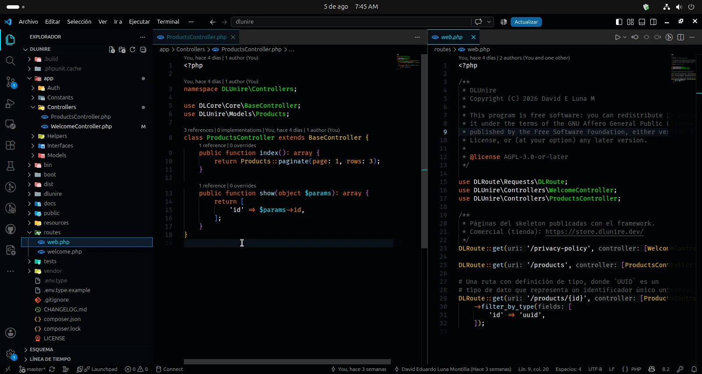
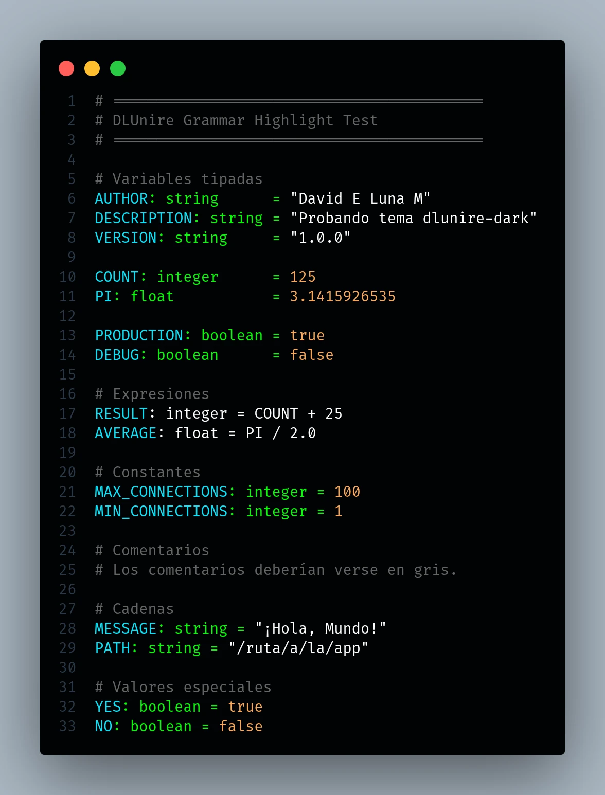

# DLUnire Dark

**A modern high-contrast color theme for Visual Studio Code.**



---

DLUnire Dark is built for developers who want a clean, high-contrast editor without giving up semantic consistency.

Instead of coloring tokens at random, the theme groups language constructs by their role in the code. That makes complex codebases easier to scan, understand, and navigate.

It was refined against real projects in the **DLUnire Framework** ecosystem and works well across modern languages — with special care for PHP and TypeScript.

### Syntax types at a glance

A compact grammar sample showing how variables, types, strings, numbers, booleans, and comments are distinguished:



---

## Table of Contents

- [Overview](#overview)
- [Gallery](#gallery)
- [Features](#features)
- [Color Palette](#color-palette)
- [Supported Languages](#supported-languages)
- [Installation](#installation)
- [Design Philosophy](#design-philosophy)
- [Repository](#repository)

---

## Overview

DLUnire Dark follows one simple idea:

> **Source code should communicate structure before syntax.**

Each construct belongs to a stable visual category. Keywords, types, functions, properties, and comments stay visually distinct, so patterns stand out faster and long sessions feel less tiring.

The theme started with PHP in mind, then was tested extensively with modern frontend stacks and systems languages.

### Main goals

- Improve readability
- Keep semantic coloring consistent
- Reduce eye strain
- Emphasize constructs that matter
- Keep the UI clean and free of noise

---

## Gallery

The screenshots below come from real projects in the **DLUnire** ecosystem — production code, not toy demos.

### TypeScript

Core modules, imports, type declarations, functions, and comments.


---

### Svelte

Components, layouts, embedded TypeScript, and application structure.


---

### SCSS

Variables, selectors, nested rules, properties, and mixins.


---

### TypeScript — Routing Engine

A larger TypeScript sample showing routing, modules, and application architecture.


---

### Rust

Traits, ownership, modules, macros, and modern Rust syntax.


---

### PHP

Namespaces, classes, methods, attributes, and modern PHP syntax.


---

### PHP Controller

A production controller built with the DLUnire Framework.


---

## Features

DLUnire Dark uses a semantic color system rather than arbitrary syntax highlighting.

### Highlights

- Ultra-dark background (`#010305`)
- High-contrast syntax highlighting
- Balanced, carefully tuned palette
- Semantic syntax classification
- Comfortable for long coding sessions
- Clear visual identity for:
  - Keywords
  - Classes
  - Interfaces
  - Traits
  - Enums
  - Functions
  - Methods
  - Variables
  - Properties
  - Attributes
  - Primitive types
  - Constants
  - Numeric literals
  - Comments
- Comments without italics
- Consistent editor chrome
- Minimal visual distractions
- Tuned for modern languages

---

## Color Palette

| Element         |   Color   | Purpose                                    |
| --------------- | :-------: | ------------------------------------------ |
| Background      | `#010305` | Ultra-dark editor background               |
| Default Text    | `#FFFFFF` | Strings and editor foreground              |
| Keywords        | `#FF6D00` | Flow control and modifiers                 |
| Declarations    | `#00D0FF` | Functions, namespaces, and declarations    |
| Classes         | `#00FF00` | Classes, interfaces, traits, and namespaces |
| Functions       | `#A0E5FF` | Functions and methods                      |
| Variables       | `#00E8FF` | Variables and parameters                   |
| Properties      | `#FF9100` | Object properties                          |
| Attributes      | `#F50057` | Language attributes                        |
| Primitive Types | `#FFC600` | Built-in language types                    |
| HTML/XML Tags   | `#1DE9B6` | HTML/XML elements                          |
| Constants       | `#A0A0FF` | Language constants and booleans            |
| Numbers         | `#FAA859` | Numeric literals                           |
| Comments        | `#656565` | Non-italic comments                        |

---

## Supported Languages

DLUnire Dark works with every language Visual Studio Code supports. Extra attention went into:

- PHP
- TypeScript
- JavaScript
- Svelte
- Rust
- HTML
- CSS
- SCSS
- JSON
- Markdown

Gallery images were captured from real **DLUnire** projects.

---

## Installation

### Visual Studio Code Marketplace

1. Open **Extensions** (`Ctrl + Shift + X`).
2. Search for **DLUnire Dark**.
3. Click **Install**.
4. Open **Preferences → Color Theme**.
5. Select **DLUnire Dark**.

Or install from the terminal:

```bash
code --install-extension dlunire.dlunire-dark
```

---

## Design Philosophy

Programming languages are structured systems. A theme should reinforce that structure, not hide it.

DLUnire Dark maps colors to the semantic role of each construct. You spot patterns faster, understand code more easily, and keep a clean, consistent look across languages.

Instead of giving every token equal weight, the theme highlights what defines architecture and behavior.

---

## Repository

**Website:** [https://dlunire.dev](https://dlunire.dev)

**Source:** [https://github.com/dlunire/theme-dlunire-dark](https://github.com/dlunire/theme-dlunire-dark)

Bug reports, feature requests, and contributions are welcome.

---

**License:** MIT · **Publisher:** [dlunire](https://dlunire.dev) · **Version:** 1.0.1
