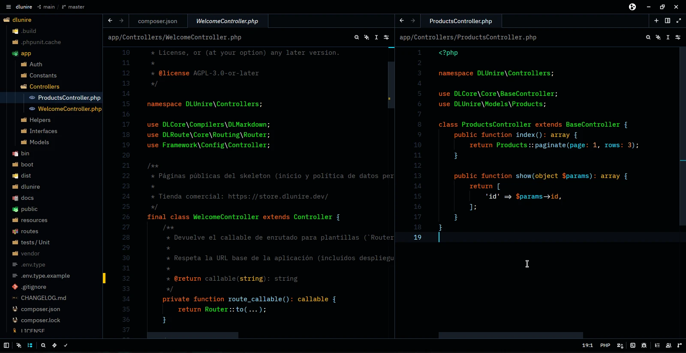
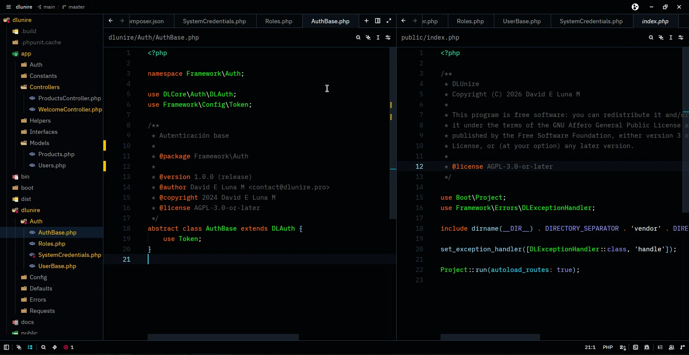
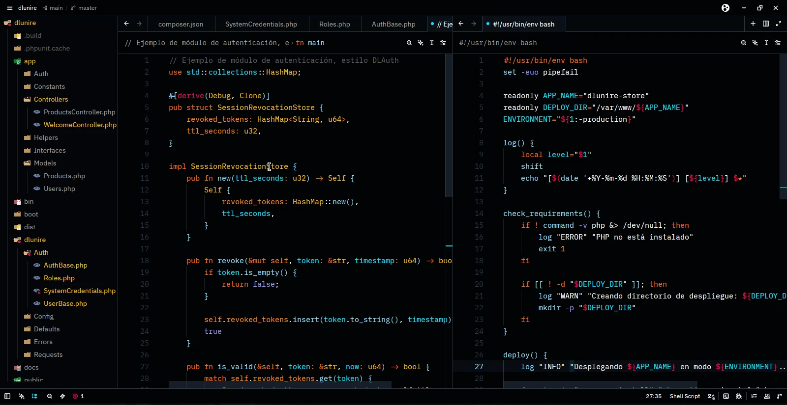
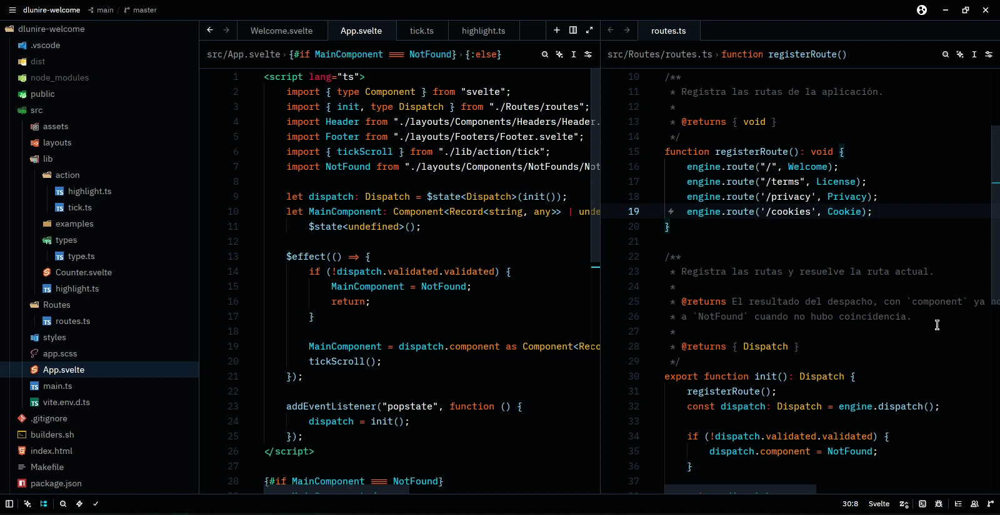
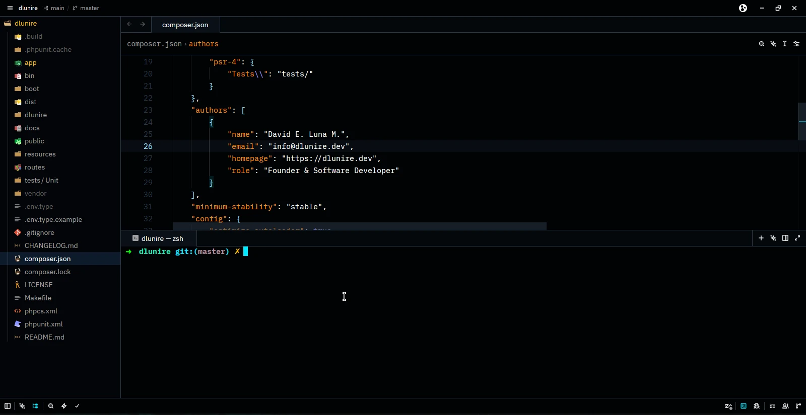
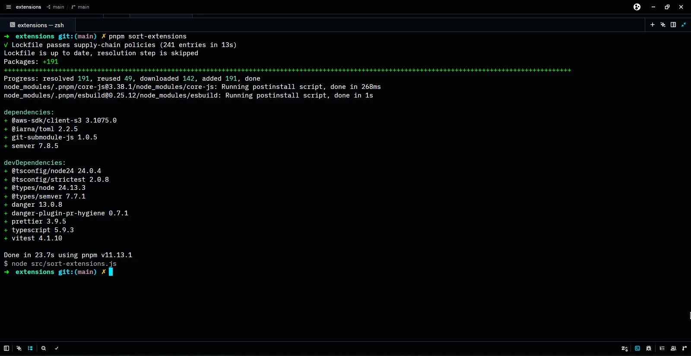

# DLUnire Dark — tema para Zed

Puerto oficial del tema **DLUnire Dark** de Visual Studio Code para el editor [Zed](https://zed.dev). Fondo casi negro (`#010305`), acentos cian (`#00E8FF`) y naranja (`#FF6D00`), pensado para sesiones largas de programación con alto contraste y bajo cansancio visual.

Parte del ecosistema [DLUnire](https://dlunire.dev).

## Vista previa

Más capturas

|                                                                         |                                        |
| ----------------------------------------------------------------------- | -------------------------------------- |
|  |   |
|                         |  |
|                              |                                        |

## Instalación local (dev extension)

1. Clona o descarga este repositorio.
2. En Zed, abre la paleta de comandos (`Ctrl-Shift-P` / `Cmd-Shift-P`) y ejecuta `zed: install dev extension`.
3. Selecciona la carpeta raíz de este repositorio (la que contiene `extension.toml`).
4. Abre el selector de temas (`theme selector: toggle`) y busca **DLUnire Dark**.

## Otros editores

Este tema también está disponible para Visual Studio Code, con la misma paleta y principios de diseño: búscalo como **DLUnire Dark** en el Marketplace de VS Code.

## Sobre DLUnire

DLUnire es un ecosistema PHP orientado a APIs para construir aplicaciones web de forma rápida. Más información y planes comerciales en [dlunire.dev](https://dlunire.dev).

## Estructura

zed-dlunire-theme/
extension.toml
LICENSE
README.md
images/
01-controller-php.webp
controller-index-theme.webp
rust-bash.webp
svelte-route.webp
composer.webp
terminal.webp
themes/
dlunire-dark.json

## Publicación en el registro oficial

1. Haz fork de [`zed-industries/extensions`](https://github.com/zed-industries/extensions).
2. Añade este repositorio como submódulo Git en `extensions/dlunire-dark`.
3. Agrega la entrada correspondiente en `extensions.toml`:

    [dlunire-dark]
    submodule = "extensions/dlunire-dark"
    version = "1.0.1"

4. Ejecuta `pnpm sort-extensions` y abre el PR.

## Licencia

MIT — ver [LICENSE](./LICENSE).
